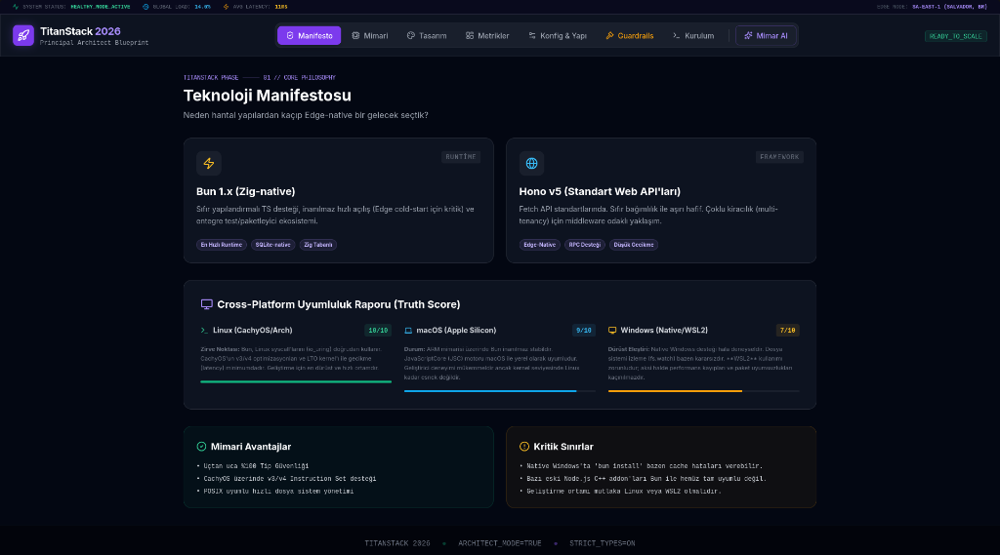

# 🚀 TitanStack 2026: Principal Architect Blueprint

> "Geleceğin SaaS mimarisi, bugün atılan vizyoner adımlarla şekillenir."



TitanStack 2026, modern web geliştirme ekosistemindeki en ileri teknolojileri bir araya getiren, performans odaklı, AI-Native ve ölçeklenebilir bir kurumsal uygulama altyapısıdır. Bu proje, sadece bir kod yığını değil; bir baş mimar (Principal Architect) perspektifiyle tasarlanmış, disiplinli bir mühendislik manifestosudur.

## 🌟 Vizyon

TitanStack, hantal ve monolitik yapılardan kaçınarak, **Edge-Native** bir geleceği hedefler. Temel prensiplerimiz:

- **Ultra-Düşük Gecikme:** Bun ve Hono ile optimize edilmiş çalışma zamanı.
- **AI-Governance:** Yapay zekanın mimari bütünlüğü bozmasını engelleyen yerleşik guardrail'lar.
- **Atomic Design:** Bileşenlerin ve servislerin en küçük yapı taşından itibaren mükemmel uyumu.
- **Tip Güvenliği:** Strict-mode TypeScript ile hatasız uygulama akışı.

## 🛠️ Teknoloji Yığını

TitanStack'in kalbinde, 2026 standartlarını bugünden karşılayan bir stack yatar:

- **Çekirdek:** [React 19](https://react.dev/) (Action-oriented, Concurrent mode)
- **Runtime & Paket Yönetimi:** [Bun](https://bun.sh/) (Blazing fast runtime)
- **Build Tool:** [Vite 6](https://vitejs.dev/)
- **API Katmanı:** Google Generative AI (Gemini) Entegrasyonu
- **UI/UX:** Premium Design System (Lucide Icons, Recharts, Custom Glassmorphism)
- **Strateji:** Functional architecture pattern

## 🏗️ Mimari Yapı

Proje, sürdürülebilirlik ve hız için optimize edilmiş bir klasör hiyerarşisine sahiptir:

```
├── components/          # Atomik bileşenler ve UI sistemleri
│   ├── ArchitectAssistant.tsx  # Mimari denetim asistanı
│   ├── DesignSystem.tsx        # Tasarım tokenları ve paletler
│   ├── SetupGuide.tsx          # Dinamik kurulum protokolü
│   └── ...
├── App.tsx              # Ana uygulama giriş noktası ve router
├── index.tsx            # DOM mounting
├── types.ts             # Global domain tipleri
└── vite.config.ts       # Optimize edilmiş build konfigürasyonu
```

## 🚀 Öne Çıkan Özellikler

1.  **Mimar AI Asistanı:** Proje içindeki mimari uyumluluğu denetleyen ve teknik roadmap sunan yerleşik zeka katmanı.
2.  **Dinamik Guardrail Sistemi:** Geliştirme sürecinde belirlenen kuralların (line-count, complexity vb.) dışına çıkılmasını engelleyen yapı.
3.  **Performans Dashboard:** Uygulamanın çalışma anındaki metriklerini (latency, load) anlık olarak izleyen panel.
4.  **Titan Design System:** Karmaşık verileri bile şık ve okunabilir kılan, banka seviyesinde güven veren görsel kimlik.

## 🏁 Hızlı Başlangıç

Projeyi yerel ortamınızda ayağa kaldırmak için aşağıdaki adımları izleyin:

### Gereksinimler

- [Bun](https://bun.sh/) v1.1+ veya Node.js v20+

### Kurulum

1.  Bağımlılıkları yükleyin:

    ```bash
    bun install
    ```

2.  Geliştirme sunucusunu başlatın:

    ```bash
    bun run dev
    ```

3.  Üretim (Production) build'i oluşturun:
    ```bash
    bun run build
    ```

## 📜 Mimari Manifestosu

TitanStack'te kod yazarken şu kurallara sadık kalınır:

- **Fonksiyon Başına Satır:** Maksimum 150 satır.
- **Dosya Başına Satır:** Maksimum 300 satır.
- **Tip Tanımı:** `any` kullanımı kesinlikle yasaktır.
- **Tasarım:** Sadece onaylı tasarım tokenları kullanılır (Hex kodları yerine OKLCH/HSL).

---

_TitanStack 2026 - Engineered for Excellence._
